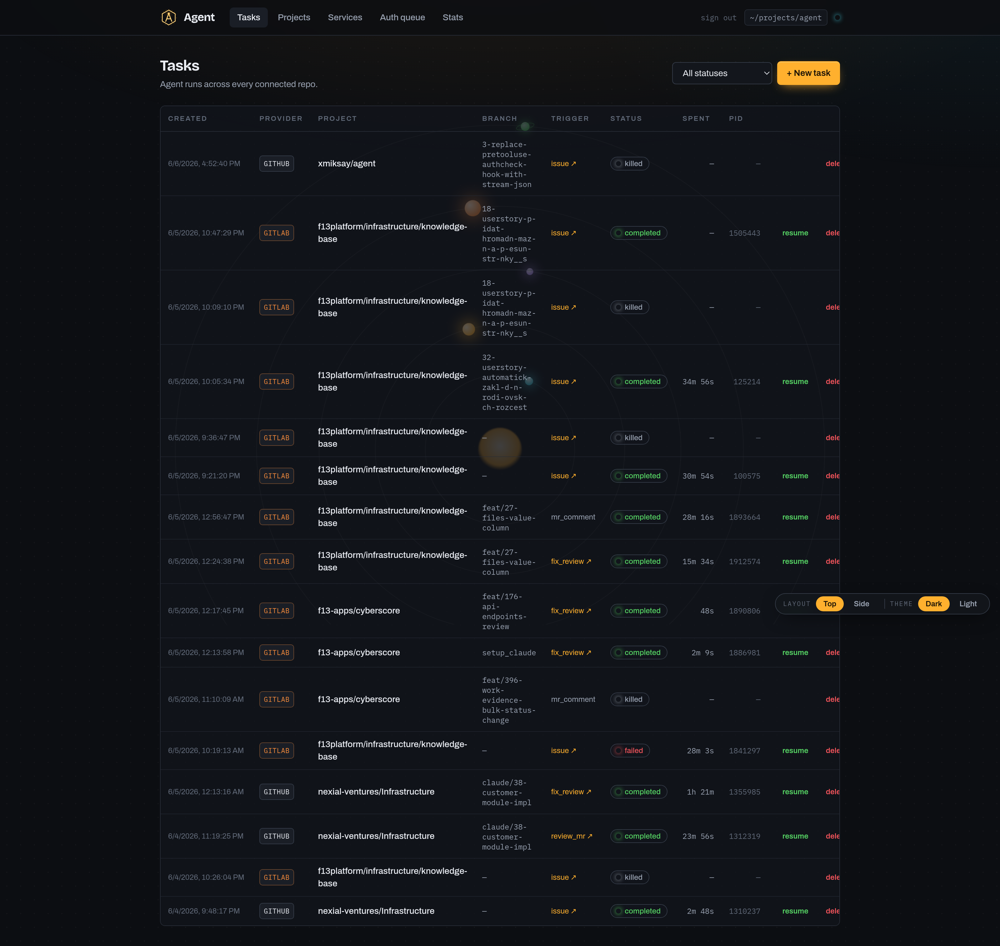
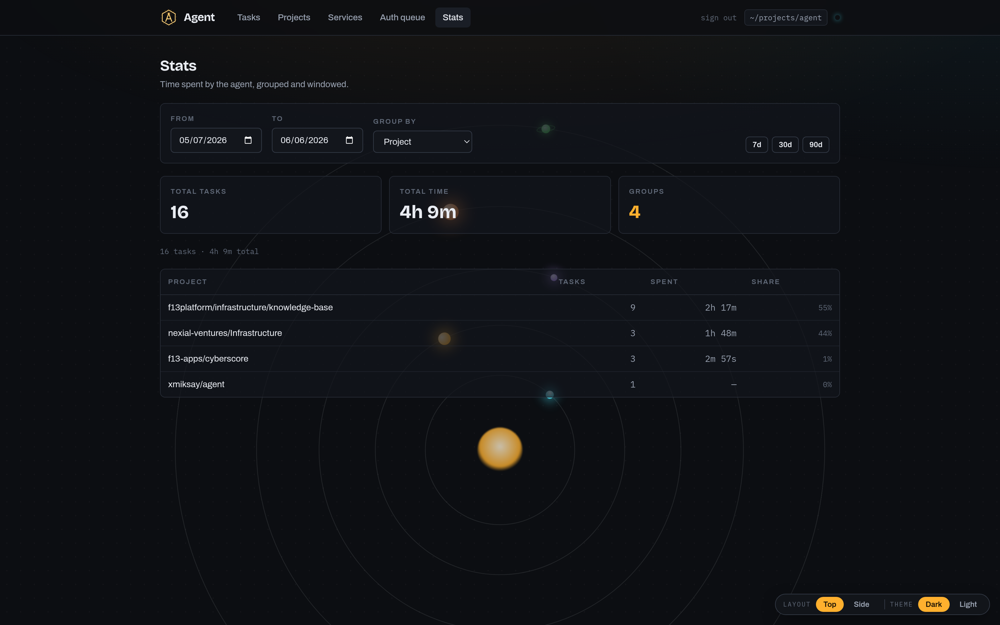

# agent

A Rust/Axum service that listens for git-forge webhooks, runs the `claude` CLI against the affected repo, and posts the result back as an issue/MR/PR comment. Supports **GitLab** and **GitHub** today; **Codeberg** (Forgejo) is planned. A Vue 3 SPA on the same port shows live task status, branch diff, captured stdout, and pending operator approvals.

Engineering rules live in [`.claude/CLAUDE.md`](.claude/CLAUDE.md) and the full architecture map in [`docs/architecture.md`](docs/architecture.md). Read those first if you're going to modify the code.

## Screenshots

The Tasks dashboard — every agent run across all connected repos, with provider, branch, trigger, status, and spend:



The Stats view — time spent by the agent, grouped and windowed:



## Setup

### 1. Configure the host

Copy `.env.example` to `.env` and set:

| Var | Default | Purpose |
|---|---|---|
| `DATABASE_URL` | — (required) | Postgres connection string |
| `REPO_BASE_PATH` | `/tmp/claude-jobs` | working-tree base: `<base>/<service_slug>/<project_slug>/<branch>` |
| `LISTEN_ADDR` | `0.0.0.0:3000` | bind address |
| `PUBLIC_BASE_URL` | unset | externally reachable base URL (e.g. `https://agent.example.com`); used to auto-register provider webhooks. Unset → auto-registration skipped, wire hooks by hand |
| `MAX_CONCURRENT_JOBS` | `3` | parallel `claude` processes |
| `TASK_TOKEN_BUDGET` | `1000000` | per-task soft output-token budget; runner pauses claude at 50 % so the operator can Resume after the 5 h rate-limit window |
| `API_BEARER_TOKEN` | unset | when set, gates `/api/*` and the SPA; paste it into the SPA on first load |
| `RUST_LOG` | `agent=info` | tracing filter |

The Vue SPA is baked into the release binary by `rust-embed` — no runtime path override.

Forge credentials (GitLab, GitHub, …) are **not** in `.env` — they live in the `service` table and are managed via the admin UI.

### 2. Run

```bash
cd frontend && npm install && npm run build   # produce frontend/dist/
cargo run                                     # rust-embed bakes the SPA into the binary; migrations run on startup
```

Visit `http://localhost:3000` and (if `API_BEARER_TOKEN` is set) paste the token. Hot-reload dev: `cd frontend && npm run dev` (vite on 5173).

### 3. Add a git service

Go to **Services → Add service** and fill in:

| Field            | Example                               |
|------------------|---------------------------------------|
| Kind             | `gitlab` (multiple allowed) / `github` (single) |
| Slug             | `personal`                            |
| Display name     | `Personal GitLab`                     |
| Base URL         | `https://gitlab.com`                  |
| Bot username     | `group_NNN_bot_agent` (the generated bot handle) |
| Access token     | GitLab: a **Group/Project Access Token** (`glpat-…`) with `api` + `write_repository`, Maintainer/Owner role — this gives the agent its **own bot identity** (a `group_NNN_bot_*` service account), so it acts as itself, not you. GitHub: a PAT with `repo` + `admin:repo_hook`. The token does git transport (token-HTTPS clone/push), note posting, **and** webhook registration |
| Webhook secret   | a random string                       |

> **GitLab bot token.** Mint the Group Access Token under the group's
> **Settings → Access Tokens**, or with the CLI:
> ```bash
> glab token create --group my-group --name agent-bot \
>   --scope api --scope write_repository --role maintainer --expires-at 2027-06-08
> ```
> Access tokens expire within **365 days** — rotate before expiry (manually, or
> via the access-tokens `…/rotate` API). See
> [`docs/application-integration.md`](docs/application-integration.md#gitlab-bot-identity-10).

After saving, the service detail page shows the **Webhook URL** to paste into the forge.

## Webhook endpoints

Per service:

```
POST  /webhook/gitlab/<slug>     # X-Gitlab-Token = the service's webhook_secret
POST  /webhook/github/<slug>     # X-Hub-Signature-256 HMAC-SHA256 of body, key = webhook_secret
```

`<slug>` is the value you entered when creating the service. Service-detail page renders the full URL for convenience.

**Auto-registration.** When `PUBLIC_BASE_URL` is set, the agent registers the webhook itself the first time it sees a project (idempotently — re-runs update in place rather than duplicating), so the manual steps below are a fallback. The PAT needs the hook-admin scope (`admin:repo_hook` on GitHub; `api` + Maintainer/Owner on GitLab). GitHub App services (planned) use an app-level hook instead.

### GitLab side

Project → **Settings → Webhooks → Add new webhook**:

- **URL** — `https://<your-agent-host>/webhook/gitlab/<slug>`
- **Secret token** — the `webhook_secret` you saved
- **Trigger** — Issues events, Comments, Merge request events (Confidential variants too if you want)
- **SSL verification** — on

You can register the same webhook at group level (`Settings → Webhooks` on the group) so it applies to every project beneath it.

To register via API instead of UI:

```bash
curl --request POST \
     --header "PRIVATE-TOKEN: $GITLAB_PAT" \
     --header "Content-Type: application/json" \
     --data '{
       "url": "https://your-agent.example.com/webhook/gitlab/personal",
       "token": "the-webhook-secret",
       "issues_events": true,
       "note_events": true,
       "merge_requests_events": true,
       "confidential_issues_events": true,
       "confidential_note_events": true,
       "enable_ssl_verification": true
     }' \
     "https://gitlab.com/api/v4/projects/<project_id>/hooks"
```

### GitHub side

Repo → **Settings → Webhooks → Add webhook**:

- **Payload URL** — `https://<your-agent-host>/webhook/github/<slug>`
- **Content type** — `application/json`
- **Secret** — the `webhook_secret` you saved
- **Events** — Issues, Issue comments, Pull requests, Pull request reviews

## How it triggers

| Event                                                  | Action |
|--------------------------------------------------------|--------|
| Issue assigned to the bot user                         | Implement, push branch, open MR/PR |
| MR/PR review with **changes requested**                | Fix and push |
| Any other MR/PR review                                 | Post a review note |
| Issue/MR/PR comment containing `@<bot_username>` | Reply in-thread |
| Issue closed / MR/PR closed/merged                     | Release the checked-out branch |

The bot user is the `bot_username` configured on the git service — only events involving that user trigger work.

## API

All routes under `/api/*` require `Authorization: Bearer $API_BEARER_TOKEN` if that env var is set.

### Tasks

- `GET /api/tasks` *(optional `?status=`)*
- `POST /api/tasks` — manual dispatch when the webhook didn't fire; body is `{ project_id, trigger }` where `trigger` is a `TriggerReason`. Resulting task is created `pending`, same as webhook-driven ones.
- `GET /api/tasks/{id}` / `DELETE /api/tasks/{id}` *(DELETE force-kills if running)*
- `POST /api/tasks/{id}/confirm` — move `pending` → `running`
- `POST /api/tasks/{id}/retry` — clone the task into a new row
- `POST /api/tasks/{id}/kill` — SIGKILL but preserve `session_id` for Resume
- `POST /api/tasks/{id}/continue` — resume via `claude -r <session_id>`
- `POST /api/tasks/{id}/message` — queue a follow-up prompt; if running, pause + resume immediately
- `GET /api/tasks/{id}/diff` — `git diff origin/<default_branch>` of the worktree (+ untracked-file listing)
- `GET /api/tasks/{id}/output` — in-memory stdout/stderr capture (lost on agent restart)

### Projects, services, approvals

- `GET /api/projects` / `GET /api/projects/{id}` / `PUT /api/projects/{id}/config` / `GET /api/projects/{id}/branches`
- `GET /api/services` / `POST /api/services`
- `GET /api/services/{id}` / `PUT /api/services/{id}` / `DELETE /api/services/{id}`
- `GET /api/auth_requests` *(optional `?status=`, `?task_id=`)*
- `GET /api/auth_requests/{id}` / `POST /api/auth_requests/{id}/resolve`

Token and webhook secret on git services are write-only — they're never returned by `GET /api/services`.

## Operator approvals (PreToolUse hook)

Claude runs with `bypassPermissions` so the only policy layer is the bundled PreToolUse hook at `defaults/.claude/hooks/authcheck.sh`. The hook posts the proposed `Bash` command (or `AskUserQuestion` payload) to `POST /internal/authcheck` (loopback-only). The handler matches against the project's `allowed_operations` glob list; on miss it opens an `auth_requests` row and blocks until the operator resolves it from the SPA. Default timeout is 10 minutes — the call returns `allowed:false` if the operator never gets to it.
